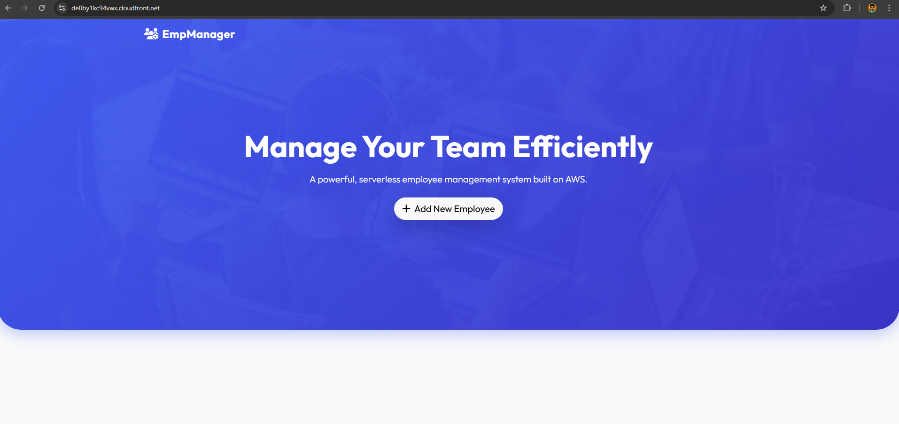
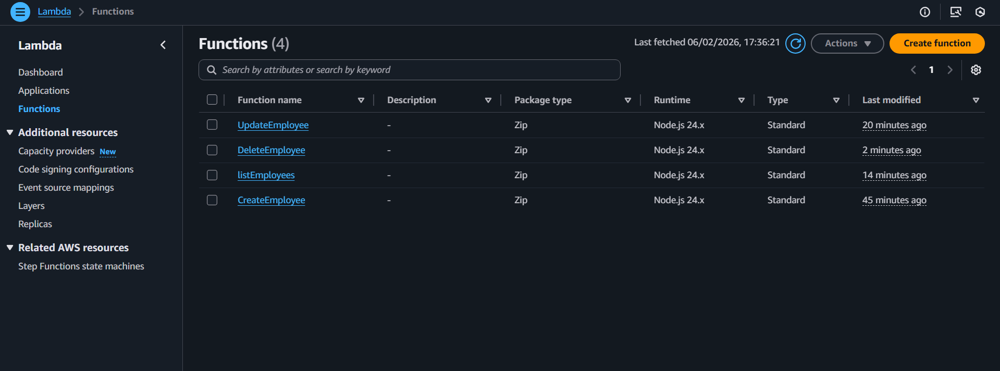
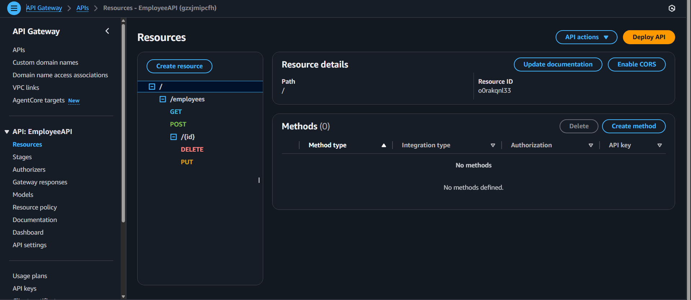
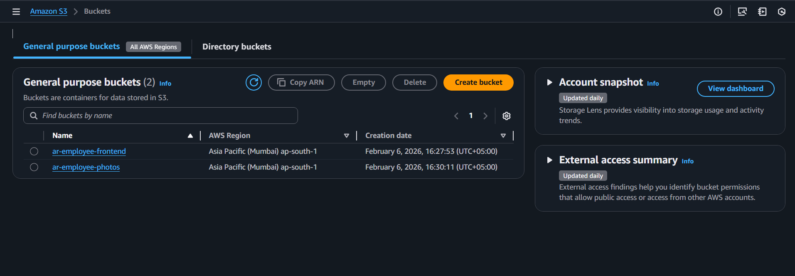
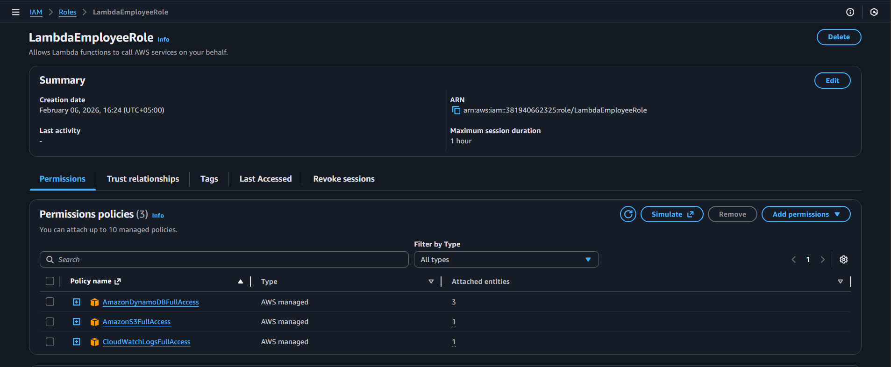

# AWS Serverless Employee Manager 🚀

A modern, serverless web application for managing employee records, built entirely on AWS. This project demonstrates a full CRUD operational system using a static frontend hosted on S3 and a serverless backend powered by Lambda and DynamoDB.

## 📖 Full Tutorial and Guide

I have documented the entire process of building this application, from setting up the AWS resources to writing the code, in my Hashnode blog. 

**👉 [Read the Full Guide on Hashnode](YOUR_HASHNODE_BLOG_LINK_HERE)**

---

## 🏗 Architecture

The application follows a serverless architecture pattern:
1.  **Frontend**: Hosted on S3 and distributed via CloudFront for global low latency.
2.  **API**: API Gateway REST API handles HTTP requests and routes them to Lambda.
3.  **Backend**: Node.js Lambda functions execute business logic (Create, List, Update, Delete).
4.  **Database**: DynamoDB provides fast, scalable NoSQL storage for employee data.
5.  **Storage**: S3 is used for storing employee profile photos (uploaded via secure presigned URLs).

---

## 🛠 Technologies Used

**Frontend:**
-   HTML5, CSS3, JavaScript (Vanilla)
-   Bootstrap 5 (UI Framework)
-   Glassmorphism & Modern UI Animations

**AWS Services:**
-   **AWS Lambda**: Serverless compute for backend logic.
-   **Amazon DynamoDB**: NoSQL database.
-   **Amazon S3**: Static hosting and object storage.
-   **Amazon API Gateway**: RESTful API endpoints.
-   **Amazon CloudFront**: Content Delivery Network (CDN).
-   **AWS IAM**: Security and permission management.

---

## 📸 Project Proof & Implementation Details

Here is the proof of the deployed application and the AWS resources configured.

### 1. The Application in Action
The fully functional employee management dashboard running on the web.

### 2. AWS Lambda Functions
Four Node.js functions handle the CRUD operations: `CreateEmployee`, `ListEmployees`, `UpdateEmployee`, and `DeleteEmployee`.

### 3. API Gateway Configuration
REST API resources configured to trigger the respective Lambda functions.

### 4. S3 Buckets
Two buckets were created: one for hosting the static website code and another for storing uploaded employee photos.

### 5. DynamoDB Table
*Screenshot not available, but here is the configuration used:*
-   **Table Name**: `Employees`
-   **Partition Key**: `id` (String)
-   **Billing Mode**: Pay-per-request (On-demand)

This table stores all employee metadata including name, role, email, and the S3 URL for their photo.

### 6. CloudFront Distribution
CloudFront is set up to serve the static website from the S3 bucket with HTTPS and low latency.

### 7. IAM Role
An IAM role (`EmpManagerLambdaRole`) was created to grant the Lambda functions permission to access DynamoDB, S3, and CloudWatch Logs.

